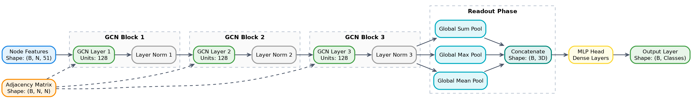
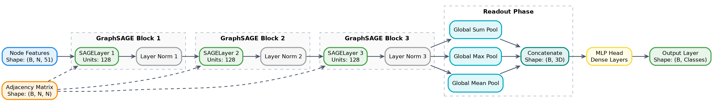
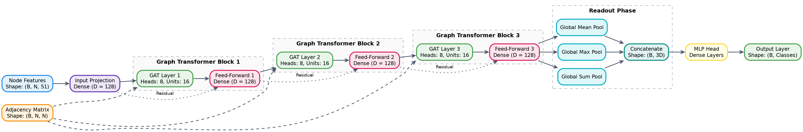
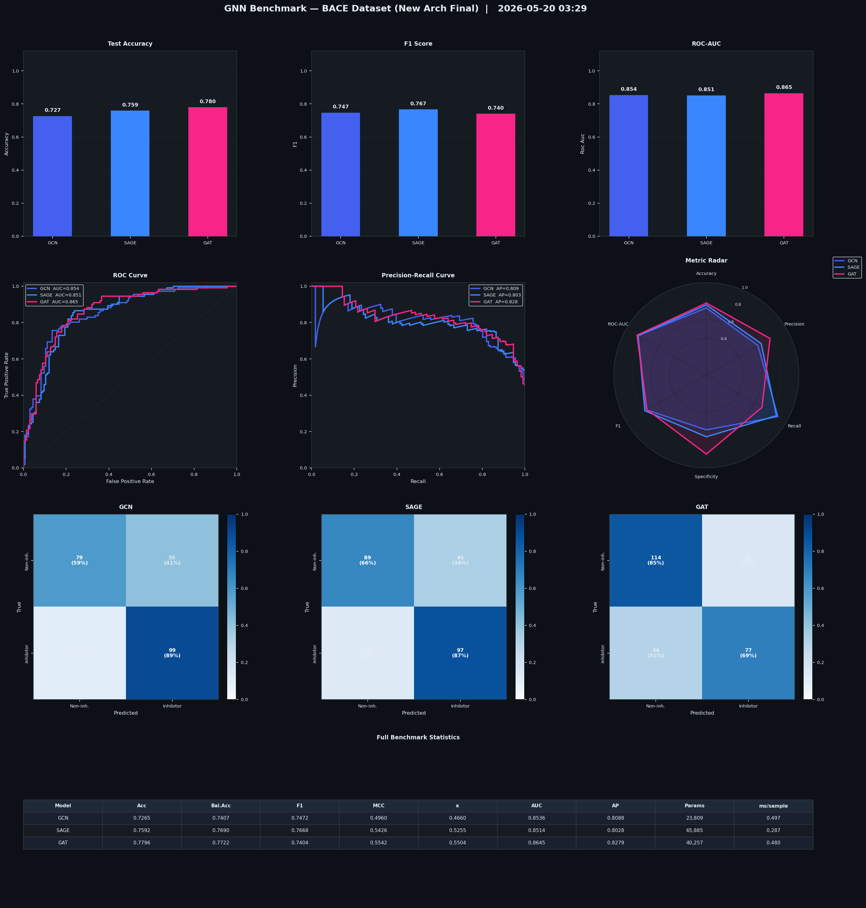

# Molecular GNN Benchmark: BACE Inhibitor Prediction


This project provides a benchmarking framework for **Graph Neural Networks (GNNs)** applied to molecular property prediction. Specifically, it targets the **BACE (Beta-secretase 1)** dataset, a critical task in drug discovery for Alzheimer's disease.

## Overview

The benchmark evaluates three state-of-the-art graph architectures:
- **GCN (Graph Convolutional Network)**
- **GraphSAGE (SAGE)**
- **GAT (Graph Attention Network)**

By leveraging graph data augmentation, this repository demonstrates how GNNs can effectively capture structural molecular information directly from SMILES strings.

---

## Model Architectures

### 1. Graph Convolutional Network (GCN)
Implementation of the standard spectral-based graph convolution. It aggregates neighbor features using a normalized adjacency matrix.
*   **Key Feature:** Neighborhood averaging with self-loops.
*   **Best for:** General graph structure learning.



### 2. GraphSAGE
A spatial-based approach that learns an aggregator function rather than fixed weights for each node.
*   **Aggregator:** Max-pooling (identifies the most salient features among neighbors).
*   **Residual Connection:** Concatenates node features with aggregated neighborhood features.



### 3. Graph Attention Network (GAT)
Utilizes multi-head self-attention mechanisms to assign different weights to different nodes in a neighborhood.
*   **Attention Heads:** 8 heads for stable learning.
*   **Flexibility:** Allows the model to focus on the most relevant atoms for the specific biological activity.



---

## Data Pipeline & Augmentation

The pipeline converts **SMILES** strings into graph objects where atoms are nodes and bonds are edges.

### Augmentation Strategies
To prevent overfitting and improve generalization, we implemented three layers of augmentation:
1.  **SMILES Enumeration:** Generates multiple non-canonical SMILES for the same molecule, resulting in different graph orderings for the same chemical structure.
2.  **Node Feature Masking:** Randomly zeroes out a fraction (10%) of atom features.
3.  **Edge Dropout:** Randomly removes non-ring, non-aromatic bonds (10%) to perturb the graph topology without breaking essential chemical motifs.

---

## Hyperparameters

| Parameter | Value |
| :--- | :--- |
| **Embedding Size** | 128 |
| **Learning Rate** | 0.005 |
| **Batch Size** | 32 |
| **Epochs** | 1000 (Early Stopping) |
| **Patience** | 100 |
| **Optimizer** | Adam |
| **Dropout** | 0.5 - 0.6 |

---

## Benchmark Results

Performance measured on the BACE test set. Results are averages across multiple seeds where applicable.

| Model | ROC-AUC | F1-Score | Accuracy | Balanced Acc. | Parameters |
| :--- | :---: | :---: | :---: | :---: | :---: |
| **GAT** | **0.8645** | 0.7404 | **0.7796** | **0.7722** | 40,257 |
| **GCN** | 0.8536 | 0.7472 | 0.7265 | 0.7407 | 23,809 |
| **SAGE** | 0.8514 | **0.7668** | 0.7592 | 0.7690 | 65,885 |

### Performance Analysis
Below is the evaluation dashboard generated by `evaluate.py`. It includes ROC/PR curves, confusion matrices, and a radar chart of key metrics.



---

## Setup & Usage

### Installation
```bash
pip install -r requirements.txt
```
There's also a `environment.yaml` to generate the env with Cindy.

### Running the Benchmark
To train all models and generate the benchmark summary:
```bash
python main.py
```

### Evaluation & Visualization
To generate the detailed report and performance graphics:
```bash
python evaluate.py
```

---

## Project Structure
- `src/models.py`: Custom GNN layers and model definitions.
- `src/dataset.py`: SMILES to graph conversion and augmentation logic.
- `src/train.py`: Standardized training loop with Early Stopping.
- `main.py`: Entry point for benchmarking.
- `evaluate.py`: Statistical analysis and visualization suite.
- `results/`: Contains performance logs and charts.

---

## License
This project is licensed under the Apache2.0 License - see the [LICENSE](LICENSE) file for details.
